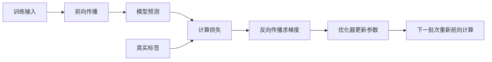

# 1.9-反向传播

前向传播按照计算关系，从输入得到各层输出、预测和损失；反向传播则利用链式法则，沿相反方向计算损失对参数的梯度。

**反向传播负责计算梯度，优化器负责根据梯度更新参数。** 损失本身不是直接修改的变量，参数改变后，下一次前向传播才会得到新的预测和损失。

## 1.9.1-从一条计算链理解链式法则

考虑只有一个隐藏单元的模型：

$$
u=wx+b,\qquad
h=g(u),\qquad
\hat y=vh+c,\qquad
L=\frac12(\hat y-y)^2
$$

其中，$w,b$ 是隐藏单元的参数，$v,c$ 是输出层的参数，$g$ 是激活函数。因子 $1/2$ 用来抵消平方求导产生的 2。

令误差 $e=\hat y-y$，从损失开始逐步求导：

$$
\frac{\partial L}{\partial\hat y}=e,
\qquad
\frac{\partial L}{\partial v}=eh,
\qquad
\frac{\partial L}{\partial c}=e
$$

隐藏层权重 $w$ 通过 $u$、$h$ 和 $\hat y$ 影响损失，因此需要把这条路径上的局部导数相乘：

$$
\frac{\partial L}{\partial w}
=
\frac{\partial L}{\partial\hat y}
\frac{\partial\hat y}{\partial h}
\frac{\partial h}{\partial u}
\frac{\partial u}{\partial w}
=e\,v\,g'(u)\,x
$$

同理：

$$
\frac{\partial L}{\partial b}=e\,v\,g'(u)
$$

例如，取 $x=2$、$y=0$、$w=1$、$b=0$、$v=0.5$、$c=0$，并使用 ReLU，则 $u=h=2$、$\hat y=e=1$、$g'(u)=1$。四个参数的梯度分别为：

$$
\frac{\partial L}{\partial w}=1,\qquad
\frac{\partial L}{\partial b}=0.5,\qquad
\frac{\partial L}{\partial v}=2,\qquad
\frac{\partial L}{\partial c}=1
$$

这些梯度都在同一组当前参数处计算。应先完成求导，再统一更新参数，不能在求导中途修改某个参数，导致后面的梯度对应另一组参数。

## 1.9.2-多条路径的贡献为什么相加

如果一个变量通过多条路径影响损失，各条路径的导数贡献需要相加。例如，总目标还包含 $\lambda w^2/2$ 时：

$$
J=L+\frac{\lambda}{2}w^2,
\qquad
\frac{\partial J}{\partial w}
=\frac{\partial L}{\partial w}+\lambda w
$$

这里的第一项来自模型预测，第二项来自正则化。对于被多个输出或多个样本共同使用的参数，也需要汇总所有相关路径的贡献。

反向传播会复用已经得到的中间梯度。例如，先计算 $\partial L/\partial u$，就可以同时求出 $w$ 和 $b$ 的梯度，而不必为每个参数重新遍历完整计算过程。

## 1.9.3-一次训练更新的顺序

1. 取出一个训练批次。
2. 清除上一批次留下的梯度，除非有意进行梯度累积。
3. 前向传播，得到模型预测。
4. 根据预测、标签和需要的正则化项计算训练目标。
5. 反向传播，计算当前参数处的梯度。
6. 优化器根据梯度、学习率及更新规则调整参数。

PyTorch 的 `loss.backward()` 将梯度累积到相关参数的 `.grad` 中。因此，普通训练循环需要在下一次反向传播前清除旧梯度；清除梯度不会重置模型权重。

## 1.9.4-初始化为什么会影响学习

反向传播依赖当前参数和激活值，初始化会影响初始输出和梯度的尺度。

在普通多层网络中，同一层的隐藏单元若具有完全对称的初始连接，可能在训练中获得相同梯度，持续学习相同的特征。适当的随机权重初始化可以打破这种对称性。偏置可以采用与权重不同的初始化规则，所以并非所有参数都必须随机取值。

初始化还需要考虑数值尺度。权重过大或过小都可能使信息或梯度在多层传递时失衡。